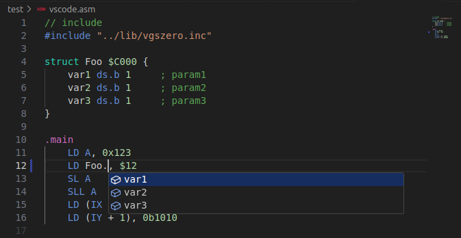

# VisualStudio Code - Extension for vgsasm

An extension to [Z80 Assembler for VGS-Zero](https://github.com/suzukiplan/vgsasm) available in VSCode.



## WIP status

This package is a **Beta Version**.

We plan to release a stable version (version 1.0.0) of this package at the same time as version 1.0.0 of the assembler itself (vgsasm).

- [x] Text Highlight
- [x] Suggestion for `struct`
- [x] Suggestion for `enum`
- [ ] Suggestion for `#macro`
- [x] Contain `#include` files for the suggestions
- [ ] Support code formatter

## How to Debug

```bash
git clone https://github.com/suzukiplan/vgsasm-extension
cd vgsasm-extension
code ./
```

After executing the above command, press the `F5` key to start the VSCode extension `vgsasm` with it enabled, and you can debug by opening the appropriate `.asm` file.

## License

[GPLv3](./LICENSE.txt)
