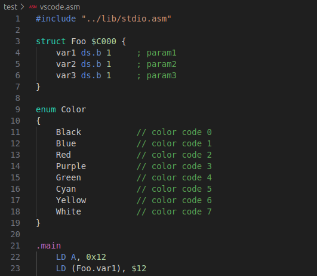
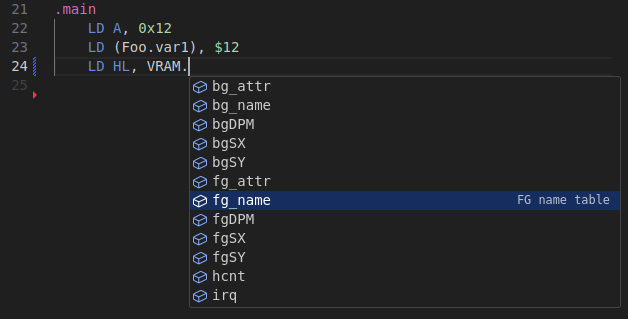
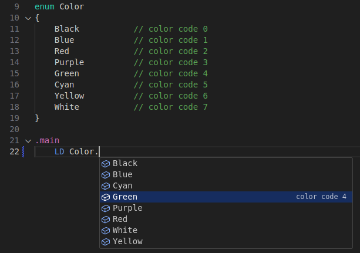
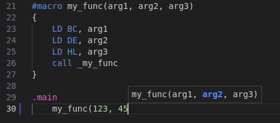

# VisualStudio Code - Extension for vgsasm

An extension to [Z80 Assembler for VGS-Zero](https://github.com/suzukiplan/vgsasm) available in VSCode.

## WIP status

This package is a **Beta Version**.

We plan to release a stable version (version 1.0.0) of this package at the same time as version 1.0.0 of the assembler itself (vgsasm).

## Features

### Text Highlight



Color-code preprocessors, reserved words, numeric literals, string literals, labels, etc.

### Suggestion for `struct`



Suggests a list of member variables when `name.` of `struct` is entered.

### Suggestion for `enum`



Suggests a list of member variables when `name.` of `enum` is entered.

### Suggestion for `#macro`



Guides the macro call process with argument information as it is entered.

### Definition Jump

To jump to a symbol whose definition you want to check, place the cursor on the symbol and click on it while holding down the ⌘ button (or F12 key).

## How to Install

Search for `vgsasm` in the Visual Studio Code marketplace and install it.

## How to Debug

```bash
git clone https://github.com/suzukiplan/vgsasm-extension
cd vgsasm-extension
code ./
```

After executing the above command, press the `F5` key to start the VSCode extension `vgsasm` with it enabled, and you can debug by opening the appropriate `.asm` file.

## License

[GPLv3](./LICENSE.txt)
